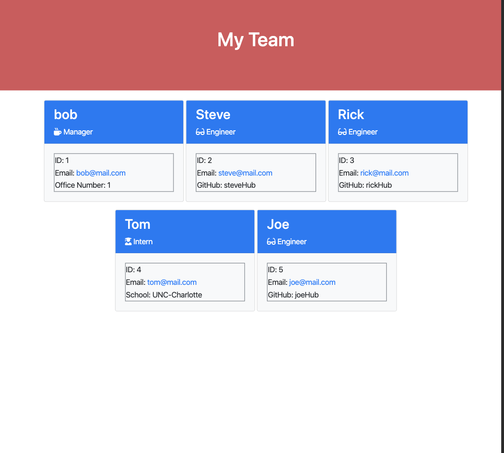

# Team Developer Profile

This project takes user input of a team and creates an HTML webpage with a summary of each member of the team displayed.

## Instructions
`npm install` is required to use the project.
* Run `node app.js` from your CLI.
* Answer the following prompts
* HTML is created once all employees are entered.
* The HTML will be saved as office?.html with the office number entered listed as the ?.

### Built With
* Node.js

#### License
MIT License Copyright (c) 2019 Taylor Bruno
